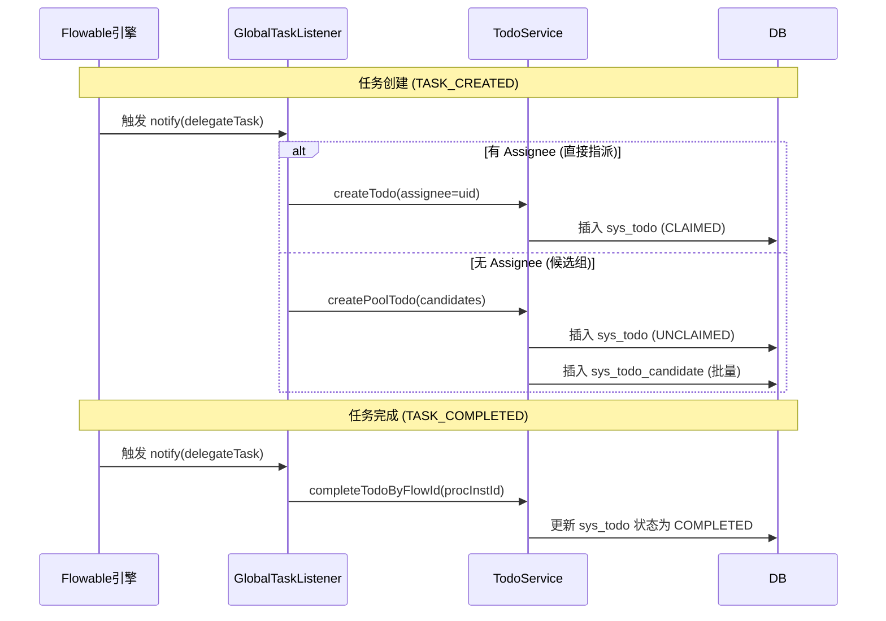
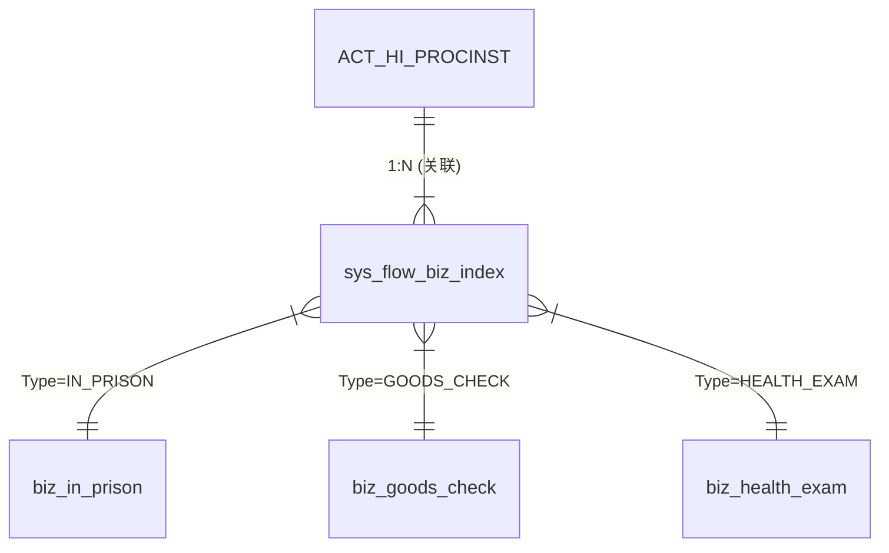
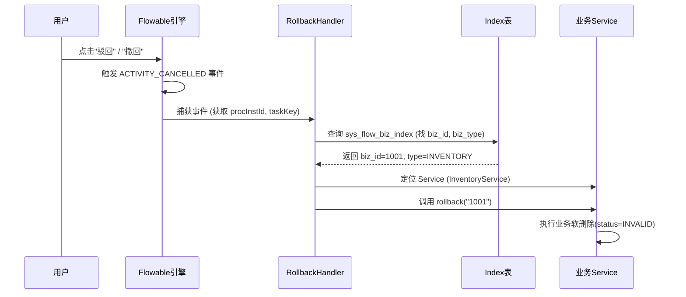

# 流程引擎问题及解决方案

---

## 一、流程待办缺失与权限适配（问题1）

**核心痛点**：Flowable 原生无持久化待办，WebSocket 推送不可靠；无法满足“岗位/角色”候选组场景。

### 1.1 数据库设计

**待办主表 `sys_todo` (变更)**

| 字段 | 类型 | 说明 |
| :--- | :--- | :--- |
| `id` | BIGINT | 主键 |
| `assignee` | BIGINT | 指派人ID (NULL表示待签收任务) |
| `claim_status` | VARCHAR(16) | **新增**：`UNCLAIMED` (待签收), `CLAIMED` (已签收) |
| `biz_flow_inst_id`| VARCHAR(64) | 关联 Flowable 流程实例ID |
| `status` | VARCHAR(16) | `OPEN` (进行中), `COMPLETED` (已完成) |

**待办候选表 `sys_todo_candidate` (新增)**

| 字段 | 类型 | 说明 |
| :--- | :--- | :--- |
| `id` | BIGINT | 主键 |
| `todo_id` | BIGINT | 关联 sys_todo.id |
| `type` | VARCHAR(16) | `ROLE` (角色), `POST` (岗位), `DEPT` (部门), `USER` (多用户) |
| `value` | VARCHAR(64) | 对应的主键值 (如 RoleID) |

### 1.2 处理流程 (GlobalTaskListener)



### 1.3 核心代码 (伪代码)

```java
@Component
public class GlobalTaskListener implements TaskListener {
    public void notify(DelegateTask task) {
        String event = task.getEventName();
        if ("create".equals(event)) {
            if (task.getAssignee() != null) {
                // 1. 点对点指派
                todoService.createAssigneeTodo(task);
            } else {
                // 2. 候选池指派 (解析 GroupID -> Role/Post)
                todoService.createCandidateTodo(task, task.getCandidates());
            }
        } else if ("complete".equals(event)) {
            // 3. 完成待办
            todoService.completeByFlowId(task.getProcessInstanceId());
        }
    }
}
```

---

## 二、异构业务表单数据关联（问题2）

**核心痛点**：业务数据分散在不同表，流程流转中难以聚合查询。

**场景示例**：
一个“入监”流程涉及 `入监登记表(Type=A, ID=100)` -> `体检表(Type=B, ID=200)` -> `物品登记表(Type=C, ID=300)`。
如果不做处理，想查询该流程的所有信息，后端代码必须硬编码查询 A、B、C 三张表。流程一改，代码就崩。

### 2.1 解决方案：业务索引表

建立一张“目录表” (`sys_flow_biz_index`)，在每一步业务操作时，记录下“哪个流程实例”关联了“哪张表的哪个ID”。

**流程业务索引表 `sys_flow_biz_index`**

| 字段 | 类型 | 说明 |
| :--- | :--- | :--- |
| `id` | BIGINT | 主键 |
| `proc_inst_id` | VARCHAR(64) | 流程实例ID (核心索引) |
| `task_key` | VARCHAR(64) | 节点定义Key (如 "audit_node") |
| `task_name` | VARCHAR(64) | 节点名称 (如 "入监审批") |
| `biz_type` | VARCHAR(32) | 业务类型枚举 (如 `IN_PRISON`, `GOODS_CHECK`) |
| `biz_id` | VARCHAR(64) | 该节点对应的业务表主键ID |
| `create_time` | DATETIME | 创建时间 |

### 2.2 数据模型关系



**模型解读**：
*   **ACT_HI_PROCINST (父)**：Flowable 原生流程实例表，代表“一次办事过程”（如张三入监）。
*   **sys_flow_biz_index (桥梁)**：作为中间索引，记录该流程实例下产生的**所有**业务数据位置。它与流程实例是 1:N 关系（一个流程对应多张业务表单）。
*   **biz_xxx (子)**：具体的业务表（如入监表、体检表）。索引表通过 `biz_type` + `biz_id` 实现**多态关联**，精准指向具体业务记录。
*   **优势**：解耦了流程引擎与具体业务表。新增业务模块（如“心理评估”）时，无需修改流程引擎核心代码，只需写入索引即可。

### 2.3 使用策略

*   **写入**：业务模块 `Service.save()` 成功后，异步/同步插入一条 `sys_flow_biz_index`。
*   **查询**：前端请求“流程全景图”时，后端先查 `sys_flow_biz_index` 获取所有 `biz_id`，再并行调用各模块详情接口组装数据。

---

## 三、流程回退的数据一致性（问题3）

**核心痛点**：流程回退时，已执行的业务逻辑（如扣库存）未回滚。

### 3.1 接口规范

所有接入流程的业务 Service 必须实现此接口：

```java
public interface FlowBusinessAware {
    /**
     * 业务回滚/撤销
     * @param bizId 业务主键
     * @return 是否成功
     */
    boolean rollback(String bizId);
}
```

### 3.2 自动回滚流程



---

## 四、历史数据查询与归档（问题4）

**核心痛点**：Flowable XML 无法解析，无法进行报表统计。

### 4.1 解决方案

**禁止** 解析 XML。
**坚持** “业务数据业务存”，而不是依赖XML。

### 4.2 归档伪代码 (EndListener)

```java
// 流程结束监听器
public class ProcessEndListener implements ExecutionListener {
    public void notify(DelegateExecution execution) {
        String procId = execution.getProcessInstanceId();
        
        // 1. 触发归档任务
        threadPool.submit(() -> {
            // 2. 从 Index 表拉取该流程所有业务ID
            List<BizIndex> indexes = indexMapper.selectByProcId(procId);
            
            // 3. 抽取各模块核心数据 (扁平化)
            Map<String, Object> flatData = dataExtractor.extract(indexes);
            
            // 4. 存入数仓或宽表
            archiveMapper.save(flatData);
        });
    }
}
```
